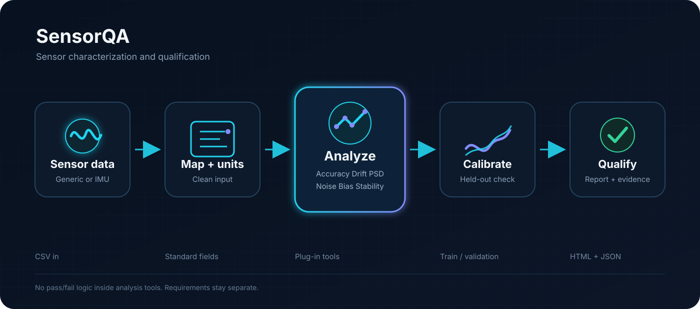

# SensorQA

SensorQA is a desktop application for sensor characterization, calibration, diagnostics, qualification, and reporting. It is designed for engineers and researchers who want a repeatable way to move from a raw CSV file to clear sensor-performance results without rebuilding the same analysis workflow for every test.

The current release supports generic reference-based sensors and IMU data. Analysis tools are plug-in based, so new checks can be added without changing the application core.

<p align="center">
  
</p>

## What you can do with SensorQA

A normal workflow is straightforward:

1. Open a CSV file in the desktop app.
2. Review the suggested column mapping.
3. Confirm engineering units and test details.
4. Run the analyses that apply to that dataset.
5. Review metrics, plots, warnings, and qualification results.
6. Optionally fit a calibration model and check it on held-out data.
7. Export the results as a standalone HTML report or JSON file.

SensorQA keeps analysis and qualification separate. Analysis tools calculate quantities such as bias, RMSE, drift, PSD, repeatability, or saturation. Pass/fail limits live in `sensorqa/configs/requirements.toml`, not inside the analysis code.

## Built-in analysis tools

SensorQA currently includes 23 built-in analysis tools.

### Generic sensor tools

These tools are intended for sensors with a measured value and, where required, a reference value.

- Accuracy
- Linearity
- Precision
- Repeatability
- Sensitivity
- Drift
- Signal-to-noise ratio
- Power spectral density
- Environmental stability
- Outlier detection
- Hysteresis
- Revision comparison

### IMU tools

These tools cover common timing, bias, noise, frequency-domain, temperature, range, and orientation checks.

- Sampling integrity
- Accelerometer bias
- Gyroscope bias
- Stationary noise
- Gravity error
- Axis correlation
- Temperature stability
- Saturation
- Power spectral density
- Allan deviation
- Six-position calibration

Not every tool should run on every dataset. SensorQA checks the sensor type, test mode, mapped columns, and tool requirements before execution. A skipped analysis usually means the dataset does not contain the information needed for that check. It is not automatically an error.

## Calibration

Calibration uses a train/validation split so the same rows are not used both to fit and evaluate a correction.

The current models are:

- offset correction
- affine gain and offset correction

SensorQA fits the model on the training subset and reports before/after performance on the held-out validation subset. The validation summary includes RMSE, MAE, bias, maximum absolute error, error spread, and R² when it is defined.

This distinction matters. A good fit on the training data is not treated as proof that the calibration generalizes.

## Desktop application

The PySide6 desktop application is the main interface for normal use. The navigation includes:

- Home
- New Analysis
- Datasets
- Results
- Calibration
- Tools
- Reports
- Settings

The New Analysis flow walks through file selection, column mapping, units, test information, and a final review before anything is run.

The Results page is designed to show the important metrics first, with detailed tables and plots available where they are useful. Engineering units are displayed in a readable form such as `m/s²`, `°C`, `°/s`, and `rad/s/√Hz` rather than exposing internal unit strings.

## Installing SensorQA

SensorQA has been tested with Python 3.10. A virtual environment is recommended.

### Linux or macOS

```bash
python -m venv .venv
source .venv/bin/activate
python -m pip install --upgrade pip
python -m pip install -r requirements.txt
```

### Windows

```powershell
python -m venv .venv
.venv\Scripts\activate
python -m pip install --upgrade pip
python -m pip install -r requirements.txt
```

The runtime dependencies are kept in `requirements.txt`. Development and test dependencies are in `requirements-dev.txt`.

## Starting the application

Run commands from the repository root.

Check that the backend, configuration, and tools can load:

```bash
python -m sensorqa.ui.app --check
```

Launch the desktop application:

```bash
python -m sensorqa.ui.app
```

A healthy startup should report no rejected tools or load errors.

## Preparing a CSV file

SensorQA does not require your source file to use SensorQA's internal field names. The import screen can suggest mappings, and you can change them before analysis.

### Generic sensor example

```csv
timestamp,measurement,reference,temperature
0.00,1.02,1.00,24.1
0.10,1.11,1.10,24.1
0.20,1.19,1.20,24.2
```

Common generic fields include:

```text
measurement
reference
timestamp
temperature
humidity
supply_voltage
revision
test_cycle
sweep_direction
```

### IMU example

```csv
timestamp,ax,ay,az,gx,gy,gz
0.000,0.02,-0.03,9.79,0.001,-0.002,0.000
0.005,0.01,-0.02,9.81,0.001,-0.001,0.001
```

Common IMU fields include:

```text
timestamp
ax, ay, az
gx, gy, gz
temperature
orientation_label
motion_state
```

Additional reference, position, velocity, quaternion, and Euler-angle fields are defined in `sensorqa/ingestion/column_mapper.py` for workflows that need them.

## Units

Known physical quantities are normalized internally to SensorQA's canonical units. Generic measurement and reference units are preserved as supplied by the user.

The desktop app shows units in normal engineering notation. For example:

```text
m/s²
°C
°/s
Hz
rad/s
rad/s/√Hz
```

When importing timestamps, make sure the selected unit matches the file. A timestamp column in seconds should use `s`; raw nanosecond timestamps should use `ns`.

## Test mode matters

Some analyses only make sense under specific test conditions.

For example:

- stationary IMU data are appropriate for bias, stationary noise, Allan deviation, and gravity-related checks
- dynamic IMU data are appropriate for timing, PSD, saturation, and other motion-compatible checks
- six-position calibration requires controlled orientation information
- temperature stability requires a temperature column with enough temperature span
- saturation checks require configured full-scale sensor ranges

SensorQA skips analyses when the required conditions are not available rather than forcing a result that would be difficult to defend.

## Understanding qualification results

Qualification compares calculated metrics with the active requirement set.

A requirement can be:

- passed
- failed
- not evaluated

`Not evaluated` does not mean failure. It usually means the metric was not produced for that dataset, the relevant analysis was skipped, or the requirement does not apply to the current test.

If only some requirements can be evaluated, the desktop app reports the result as partially evaluated instead of implying that nothing was checked.

## Reports and exports

SensorQA can export a standalone HTML report containing the dataset summary, qualification results, analysis metrics, warnings, and available plots. Results can also be exported as JSON for downstream processing.

Calibration results can be included in the report when calibration has been run for the current dataset.

## Configuration

The default runtime behavior is controlled by two TOML files:

```text
sensorqa/configs/sensorqa.toml
sensorqa/configs/requirements.toml
```

`sensorqa.toml` controls which tools are enabled and their default parameters.

`requirements.toml` contains the engineering thresholds used for qualification.

Most users should not need to edit these files for a normal analysis. They are useful when a team wants version-controlled defaults for a repeated test program.

## Custom analysis tools

Trusted local plug-ins can be placed in:

```text
sensorqa/tools/custom/
```

A custom tool subclasses `BaseAnalysisTool` and provides valid `ToolMetadata`. SensorQA discovers and validates the tool before making it available to the application.

Custom Python plug-ins are executable code. Only load plug-ins from sources you trust.

See `sensorqa/tools/custom/README.md` for the short plug-in note.

## Trying SensorQA with public data

A useful first IMU validation dataset is the TUM VI visual-inertial dataset. A dynamic room sequence is a good check for CSV ingestion, timestamp handling, sampling integrity, PSD, axis correlation, result rendering, and report export.

For an exported TUM VI IMU file, the expected physical units are typically:

```text
Timestamp     ns in the raw exported file, or s after conversion
Accelerometer m/s²
Gyroscope     rad/s
```

The room sequences are dynamic, so stationary-only analyses should be skipped. The long TUM VI static IMU recording is more appropriate for validating stationary bias, noise, Allan deviation, and temperature-related analyses.

Public datasets are useful for realism, but they do not replace controlled synthetic tests. Synthetic data are still the best way to verify that a known injected bias, scale error, drift, noise level, or outlier is recovered correctly.

## Tests

Install the development dependencies:

```bash
python -m pip install -r requirements-dev.txt
```

Run the complete test suite from the repository root:

```bash
pytest -q sensorqa/tests
```

The test suite covers configuration contracts, tool loading, ingestion, requirements, diagnostics, calibration, IMU metric contracts, and application-level workflows.

## Project layout

```text
SensorQA/
├── README.md
├── requirements.txt
├── requirements-dev.txt
├── assets/
│   └── sensorqa_graphical_abstract.svg
└── sensorqa/
    ├── bootstrap.py
    ├── calibration/
    ├── configs/
    ├── core/
    ├── diagnostics/
    ├── ingestion/
    ├── presentation/
    ├── reporting/
    ├── services/
    ├── tests/
    ├── tools/
    │   ├── generic/
    │   ├── imu/
    │   └── custom/
    └── ui/
```

The layers are intentionally separate. The desktop interface calls the service layer, while ingestion, analysis, calibration, qualification, and reporting remain independent of the GUI.

## Notes on interpretation

SensorQA reports what the data support and tries not to turn statistical relationships into causal conclusions.

For example, axis correlation is reported as correlation, not automatically as physical misalignment. Temperature-related changes are reported as associations unless the test design supports a stronger conclusion.

Similarly, a requirement result means that a calculated metric was compared with a configured engineering threshold. SensorQA does not replace a certification procedure, a calibration standard, or a test method required by a specific industry or regulatory body.

## Troubleshooting

**The app does not start**

Run:

```bash
python -m sensorqa.ui.app --check
```

This checks configuration loading, tool discovery, and startup errors without opening the GUI.

**An analysis is skipped**

Check the sensor type, test mode, mapped columns, units, and any tool-specific data requirements. Skipped analyses are often expected when the dataset does not support that check.

**Qualification says partially evaluated**

Some requirements were checked and others could not be evaluated with the available results. Open the Results page to see which requirements were evaluated.

**Saturation is not evaluated**

Accelerometer and gyroscope saturation checks need full-scale sensor ranges. Add the appropriate range information for the sensor being tested.

**Sampling rate looks wrong**

Check the timestamp unit first. Confusing seconds and nanoseconds can make every timing-based analysis incorrect.

## Development notes

When extending SensorQA:

- keep engineering thresholds in the requirements configuration rather than inside analysis tools
- preserve the held-out validation workflow for calibration
- add new sensor fields through the shared mapping layer
- keep GUI code separate from scientific calculations
- run the full test suite before publishing changes

The codebase uses repository-relative path resolution rather than developer-specific absolute paths, so it can be cloned and run from a different machine without editing local filesystem paths.

## License

The works is released under MIT license.
